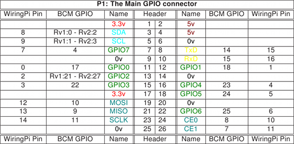

Working principles
==================

The GPIO on the Raspberry Pi is considered a device by the Linux system, and as such, it can be manipulated by software. However, the device is simply a set of memory addresses mapped to the ``/dev/mem`` file (which represents the physical memory of the device as well). This property difficults the access to the GPIO ports, and though some libraries take care of it very effectively (through mapping), the majority of solutions only work for privileged users (i.e. root). Quick2wire provides a library that provides access to unprivileged users. It is only tested for the `Raspbian <http://raspbian.org>`_ operating system and there is only a Python implementation. This port, tested on Arch Linux ARM and a Raspberry Pi 2 B allows developers to create applications with the library using C++.

The library bases its functionality on system calls to the gpio-admin binary (which should be installed on the system, otherwise the library will not work). This binary has the UID bit set, and so several privileged operations can be carried out by non-privileged users (those on the gpio group).

In order to give access to the GPIO, gpio-admin maps the segment in ``/dev/mem`` to a folder inside the ``/sys/devices/soc``. When opening a pin, a directory is created with a set of files writable by non-privileged users. These files change the behaviour of the pin upon modification, and their names refer to the property that they alter. The most relevant are *value*, *direction* and *edge*.

The API abstracts the above processes in a :doc:`Pin </reference>` object, which resembles as a file descriptor.

	A diagram of the GPIO pins and their values.